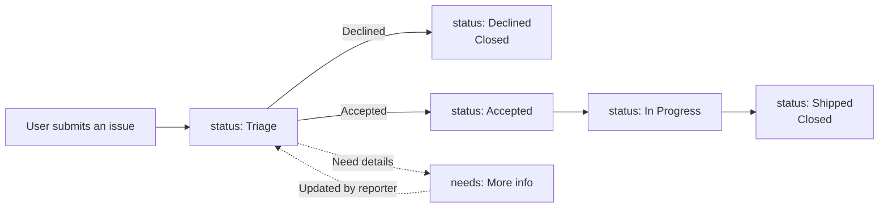

# ZCode User Feedback

**The official ZCode feedback hub for suggestions, bug reports, usage questions, and transparent progress tracking.**

[English](./README.md) · [简体中文](./README.zh-CN.md)

---

## Community

- **Global community:** Join our [Discord server](https://discord.gg/EpH5XkTyhu) for product updates, feedback discussions, and help from the community.
- **Mainland China community:** Scan the QR code below to join the ZCode user feedback group.

  

---

## Quick Links

| I want to... | Where to go |
| --- | --- |
| Suggest a **feature** | [Create a feature request ->](../../issues/new?template=feature_request.yml) |
| Report a **bug** | [Submit a bug report ->](../../issues/new?template=bug_report.yml) |
| Ask a **usage question** | [Go to Discussions ->](../../discussions) |
| Check **progress** | [Project board ->](../../projects) · [Issues ->](../../issues) |
| Read the **roadmap** | [ROADMAP.md ->](./ROADMAP.md) |
| See **recent updates** | [CHANGELOG.md ->](./CHANGELOG.md) |

Please search existing [Issues](../../issues?q=is%3Aissue) and [Discussions](../../discussions) before submitting, so we can keep duplicate reports together.

---

## Our Commitment

- **First-response SLA:** a maintainer will comment within 3 business days.
- **Transparent status:** every issue carries a `status:` label and can be tracked on the [project board](../../projects).
- **Explained decisions:** declined suggestions receive a written reason in the issue comments.

---

## Workflow

---

## Labels

### Status

| Label | Meaning |
| --- | --- |
| `status: 待评估` | Triage: received and waiting for team review |
| `status: 已采纳` | Accepted: confirmed and waiting for scheduling |
| `status: 开发中` | In Progress: currently being implemented |
| `status: 已上线` | Shipped: released to users |
| `status: 已拒绝` | Declined: not planned after evaluation, with reason |

### Type
`type: 功能建议` · `type: Bug` · `type: 使用问题`

### Severity
`severity: 阻塞` · `severity: 影响体验` · `severity: 轻微`

### Priority
`priority: P0` · `priority: P1` · `priority: P2`

### Category
`cat: UI` · `cat: 性能` · `cat: 稳定性` · `cat: 对话` · `cat: 工具/MCP` · `cat: 文件操作` · `cat: 模型` · `cat: 账号` · `cat: 计费` · `cat: 文档`

### Agent Framework
`fw: ZCode Agent` · `fw: Claude Code` · `fw: Codex` · `fw: opencode` · `fw: Gemini CLI`

### Misc
`needs: 更多信息` · `needs: 复现` · `good first issue` · `help wanted`

---

## More Docs

- [CONTRIBUTING.md](./CONTRIBUTING.md) — How to file high-quality feedback
- [CODE_OF_CONDUCT.md](./CODE_OF_CONDUCT.md) — Code of conduct
- [SECURITY.md](./SECURITY.md) — Private vulnerability reporting
- [SUPPORT.md](./SUPPORT.md) — Where to ask
- [ROADMAP.md](./ROADMAP.md) — Roadmap
- [CHANGELOG.md](./CHANGELOG.md) — Release notes

---

## Thanks

Thanks to everyone who files feedback, joins discussions, and helps make ZCode better.

<!-- prettier-ignore -->
This is a feedback repository. Content is licensed under [CC BY 4.0](./LICENSE).
