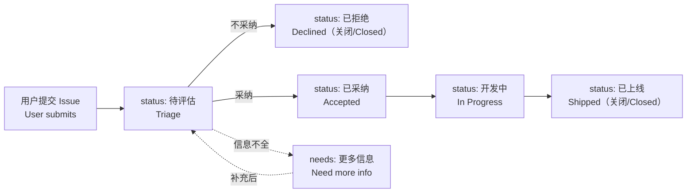

# ZCode 用户反馈

**ZCode 官方用户反馈中心：收集建议、追踪缺陷、公开处理进度**
The official ZCode feedback hub for suggestions, bug reports, and transparent progress tracking.

[English](./README.md) · [简体中文](./README.zh-CN.md)

---

## 社群入口 · Community

- **国内社群**：扫描下方二维码加入 ZCode 用户反馈群。
- **海外社群**：欢迎加入 [Discord 频道](https://discord.gg/EpH5XkTyhu)，获取产品动态、参与反馈讨论、和社区用户互助。

  

---

## 📌 快速入口 · Quick Links

| 我想…… | I want to… | 入口 |
| --- | --- | --- |
| 提一个**功能建议** | Suggest a **feature** | [新建建议 →](../../issues/new?template=feature_request.yml) |
| 报一个 **Bug** | Report a **bug** | [提交 Bug →](../../issues/new?template=bug_report.yml) |
| 问个**使用问题** | Ask a **usage question** | [前往 Discussions →](../../discussions) |
| 看**处理进度** | See **progress** | [Project 看板 →](../../projects) · [Issues 列表 →](../../issues) |
| 看**未来规划** | See the **roadmap** | [ROADMAP.md →](./ROADMAP.md) |
| 看**最近更新** | See **changelog** | [CHANGELOG.md →](./CHANGELOG.md) |

> 提交前请先在 [Issues](../../issues?q=is%3Aissue) 和 [Discussions](../../discussions) 搜一下，避免重复。
> Please search existing issues and discussions before submitting to avoid duplicates.

---

## 🤝 我们的承诺 · Our Commitment

- **首次响应 SLA**：3 个工作日内会有维护者评论你的 issue。
  *First-response SLA: a maintainer will comment within 3 business days.*
- **状态全程公开**：每条反馈都有明确的 `status:` 标签，可在 [看板](../../projects) 看到流转。
  *Full transparency: every issue carries a `status:` label, visible on the project board.*
- **拒绝会说明原因**：被标为 `已拒绝` 的建议，我们会在评论里给出理由。
  *Rejections are explained: declined suggestions get a written reason.*

---

## 🔄 处理流程 · Workflow

---

## 🏷️ 标签体系 · Labels

### 状态 / Status

| 标签 Label | 含义 Meaning |
| --- | --- |
| `status: 待评估` | 已收到，等待团队评估 · Triage |
| `status: 已采纳` | 已确认会做，等待排期 · Accepted |
| `status: 开发中` | 正在开发 · In Progress |
| `status: 已上线` | 已发布到线上 · Shipped |
| `status: 已拒绝` | 经评估暂不采纳（含原因） · Declined |

### 类型 / Type
`type: 功能建议` · `type: Bug` · `type: 使用问题`

### 严重程度（Bug 专用） / Severity
`severity: 阻塞` · `severity: 影响体验` · `severity: 轻微`

### 优先级 / Priority
`priority: P0` · `priority: P1` · `priority: P2`

### 问题类别 / Category（横向能力）
`cat: UI` · `cat: 性能` · `cat: 稳定性` · `cat: 对话` · `cat: 工具/MCP` · `cat: 文件操作` · `cat: 模型` · `cat: 账号` · `cat: 计费` · `cat: 文档`

### Agent 框架 / Framework
`fw: ZCode Agent` · `fw: Claude Code` · `fw: Codex` · `fw: opencode` · `fw: Gemini CLI`

### 其他 / Misc
`needs: 更多信息` · `needs: 复现` · `good first issue` · `help wanted`

---

## 📚 进阶文档 · More

- [CONTRIBUTING.md](./CONTRIBUTING.md) — 怎么提一份高质量反馈 / How to file great feedback
- [CODE_OF_CONDUCT.md](./CODE_OF_CONDUCT.md) — 社区行为准则 / Code of conduct
- [SECURITY.md](./SECURITY.md) — 安全漏洞私密上报 / Private vulnerability reporting
- [SUPPORT.md](./SUPPORT.md) — 我该去哪儿？ / Where to ask
- [ROADMAP.md](./ROADMAP.md) — 产品路线图 / Roadmap
- [CHANGELOG.md](./CHANGELOG.md) — 发布记录 / Release notes

---

## 🙏 致谢 · Thanks

感谢每一位提交反馈、参与讨论、推动 ZCode 变得更好的用户。
Thanks to everyone who files feedback, joins discussions, and helps make ZCode better.

<!-- prettier-ignore -->
This is a feedback repository. Content is licensed under [CC BY 4.0](./LICENSE).
